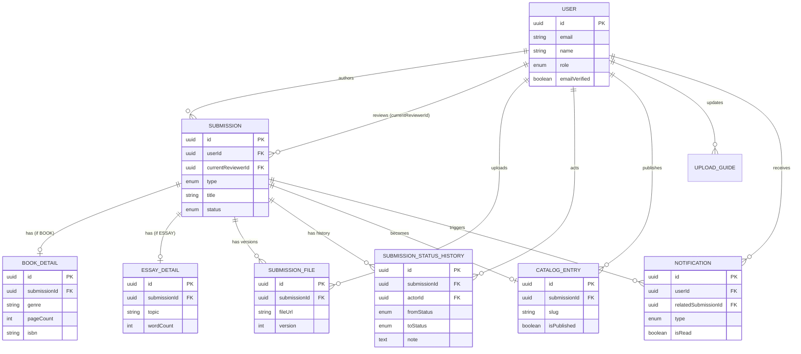

# Database Schema — Web Publishing Platform

**Versi:** 1.1
**Tanggal:** 8 September 2026
**Status:** Final draft (siap di-generate ke PDF)

---

## 1. Entities

### 1.1 `User` (di-extend dari tabel Better Auth)

| Field | Tipe | Constraint |
|---|---|---|
| id | uuid | PK |
| email | string | unique |
| name | string | |
| role | enum(`ADMIN`, `USER`) | default `USER` |
| emailVerified | boolean | default false |
| createdAt | timestamp | |
| updatedAt | timestamp | |

> Better Auth generate tabel tambahan sendiri (`session`, `account`, `verification`) untuk menangani magic link & session. Tabel `User` ini adalah tabel inti yang di-extend field custom (`role`), bukan pengganti skema Better Auth.

---

### 1.2 `Submission`

| Field | Tipe | Constraint |
|---|---|---|
| id | uuid | PK |
| userId | uuid | FK → `User.id` (author) |
| type | enum(`BOOK`, `ESSAY`) | |
| title | string | |
| description | text | |
| status | enum(`DRAFT`, `AWAITING_REVIEW`, `IN_REVIEW`, `ACTION_REQUIRED`, `RESUBMITTED`, `APPROVED`, `REJECTED`) | default `DRAFT` |
| currentReviewerId | uuid, nullable | FK → `User.id` (admin yang pegang saat `IN_REVIEW`) |
| submittedAt | timestamp, nullable | diisi saat pertama kali submit |
| createdAt | timestamp | |
| updatedAt | timestamp | |

> `Submission` sekarang generik — detail spesifik tipe (buku/esai) dipisah ke `BookDetail` / `EssayDetail` supaya query & analitik per tipe lebih rapi.

---

### 1.3 `BookDetail`

| Field | Tipe | Constraint |
|---|---|---|
| id | uuid | PK |
| submissionId | uuid | FK → `Submission.id`, unique (1-1) |
| genre | string | |
| pageCount | int | |
| language | string, nullable | |
| isbn | string, nullable | biasanya diisi belakangan, setelah approved |
| createdAt | timestamp | |
| updatedAt | timestamp | |

---

### 1.4 `EssayDetail`

| Field | Tipe | Constraint |
|---|---|---|
| id | uuid | PK |
| submissionId | uuid | FK → `Submission.id`, unique (1-1) |
| topic | string | |
| wordCount | int, nullable | |
| createdAt | timestamp | |
| updatedAt | timestamp | |

---

### 1.5 `SubmissionFile`

| Field | Tipe | Constraint |
|---|---|---|
| id | uuid | PK |
| submissionId | uuid | FK → `Submission.id` |
| fileUrl | string | path di object storage |
| fileName | string | |
| version | int | naik tiap resubmit |
| uploadedById | uuid | FK → `User.id` |
| uploadedAt | timestamp | |

---

### 1.6 `SubmissionStatusHistory`

| Field | Tipe | Constraint |
|---|---|---|
| id | uuid | PK |
| submissionId | uuid | FK → `Submission.id` |
| fromStatus | enum, nullable | null kalau entry pertama |
| toStatus | enum | |
| actorId | uuid | FK → `User.id` |
| note | text, nullable | wajib diisi kalau `toStatus` = `ACTION_REQUIRED`/`REJECTED` |
| createdAt | timestamp | |

---

### 1.7 `CatalogEntry`

| Field | Tipe | Constraint |
|---|---|---|
| id | uuid | PK |
| submissionId | uuid | FK → `Submission.id`, unique (1-1), hanya submission `APPROVED` |
| slug | string | unique, untuk URL publik |
| coverImageUrl | string, nullable | |
| isPublished | boolean | default false |
| publishedAt | timestamp, nullable | |
| publishedById | uuid, nullable | FK → `User.id` |
| createdAt | timestamp | |
| updatedAt | timestamp | |

---

### 1.8 `PublisherProfile` (singleton)

| Field | Tipe | Constraint |
|---|---|---|
| id | uuid | PK (selalu 1 row) |
| name | string | |
| about | text | |
| vision | text, nullable | |
| mission | text, nullable | |
| contactEmail | string | |
| contactPhone | string, nullable | |
| address | text, nullable | |
| logoUrl | string, nullable | |
| updatedAt | timestamp | |

---

### 1.9 `UploadGuide` (CMS-lite)

| Field | Tipe | Constraint |
|---|---|---|
| id | uuid | PK |
| type | enum(`BOOK`, `ESSAY`, `GENERAL`) | |
| content | text (markdown) | |
| updatedById | uuid | FK → `User.id` |
| updatedAt | timestamp | |

---

### 1.10 `Notification`

| Field | Tipe | Constraint |
|---|---|---|
| id | uuid | PK |
| userId | uuid | FK → `User.id` (penerima) |
| type | enum(`STATUS_CHANGE`, `NEW_SUBMISSION`, `RESUBMISSION`) | |
| title | string | |
| message | text | |
| relatedSubmissionId | uuid, nullable | FK → `Submission.id` |
| isRead | boolean | default false |
| createdAt | timestamp | |

---

## 2. Relationships

| Relasi | Kardinalitas | Keterangan |
|---|---|---|
| `User` → `Submission` | 1 : N | sebagai author (`Submission.userId`) |
| `User` → `Submission` | 1 : N | sebagai reviewer (`Submission.currentReviewerId`, nullable) |
| `Submission` → `BookDetail` | 1 : 0..1 | hanya jika `type = BOOK` |
| `Submission` → `EssayDetail` | 1 : 0..1 | hanya jika `type = ESSAY` |
| `Submission` → `SubmissionFile` | 1 : N | |
| `Submission` → `SubmissionStatusHistory` | 1 : N | |
| `Submission` → `CatalogEntry` | 1 : 0..1 | hanya submission `APPROVED` |
| `User` → `SubmissionFile` | 1 : N | sebagai uploader |
| `User` → `SubmissionStatusHistory` | 1 : N | sebagai actor |
| `User` → `CatalogEntry` | 1 : N | sebagai publisher |
| `User` → `UploadGuide` | 1 : N | sebagai updater |
| `User` → `Notification` | 1 : N | sebagai penerima |

---

## 3. ERD Diagram (Mermaid)

---

## 4. Catatan Desain

- **Kenapa `BookDetail`/`EssayDetail` dipisah:** menghindari kolom nullable campur aduk di `Submission`, dan lebih enak untuk query analitik per tipe konten (misal: rata-rata `pageCount` buku yang approved, distribusi `topic` esai) tanpa filter `WHERE type = ...` di tabel gabungan.
- **`currentReviewerId` tetap dipertahankan** di `Submission` (bukan diturunkan dari `SubmissionStatusHistory`) supaya query "naskah yang sedang di-review si Admin X" tidak perlu subquery ke tabel history — penting untuk performa dashboard admin.
- **`PublisherProfile` singleton** — cukup satu row, di-enforce di level aplikasi (atau constraint DB kalau mau lebih ketat, misal fixed id).
- **`CatalogEntry` terpisah dari `Submission`** — mempertahankan pemisahan antara "status editorial" (`Submission.status`) dan "status tayang publik" (`CatalogEntry.isPublished`), sesuai keputusan di PRD bahwa approved ≠ otomatis publish.